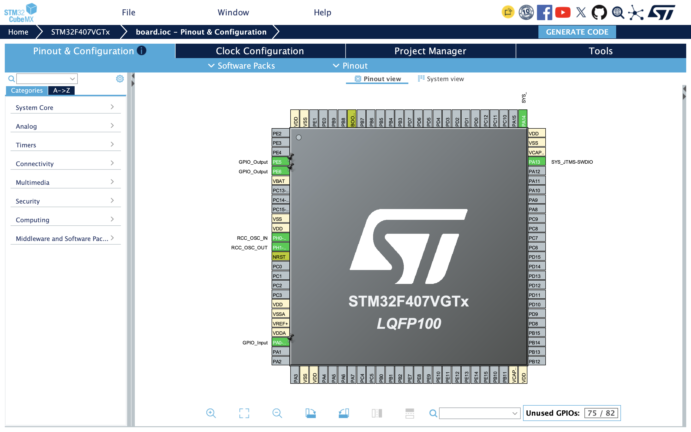
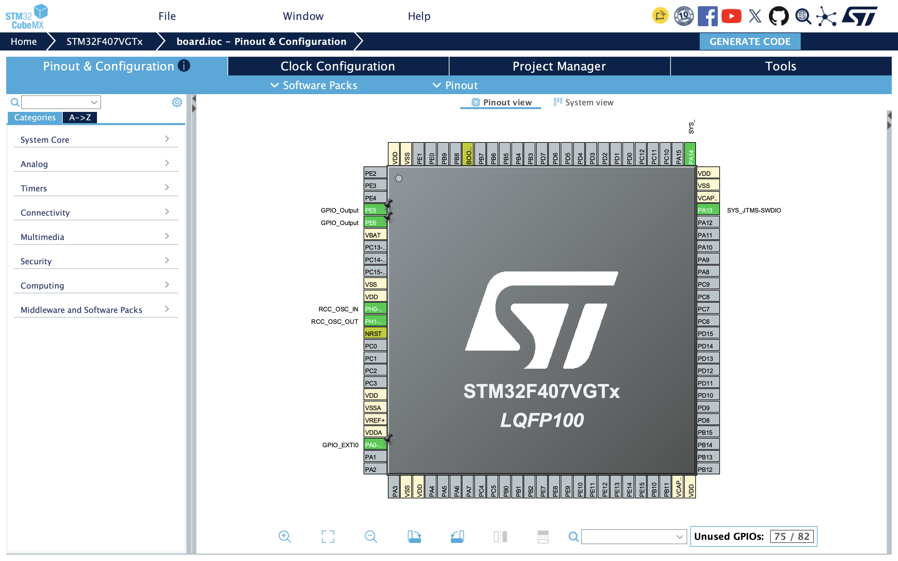

# STM32F407 作业记录

开发板型号：STM32F407VGT6 最小系统板。

## 作业一：GPIO 轮询方式控制 LED

### 任务目标

- 红色 LED 按 4 秒周期闪烁，即点亮 2 秒、熄灭 2 秒。
- 主循环轮询按键状态，在检测到按键有效电平后翻转绿色 LED。

### CubeMX 配置

- `PE5`：GPIO 输出，用于控制红色 LED。
- `PE6`：GPIO 输出，用于控制绿色 LED。
- `PA0`：GPIO 输入，用于读取按键状态。

### 实现说明

轮询版在 `while (1)` 主循环中运行。程序通过两次 `HAL_Delay(2000)` 控制 PE5 的高低电平，使红色 LED 每 4 秒完成一次亮灭循环；随后使用 `HAL_GPIO_ReadPin()` 读取 PA0。检测到按键有效电平时，通过 `HAL_GPIO_TogglePin()` 翻转 PE6，并等待按键状态释放，避免一次持续按压被重复处理。

对应工程位于 `stm32f407vgt6/polling/`。

## 作业二：GPIO 外部中断方式控制 LED

### 任务目标

- 保留红色 LED 的 4 秒闪烁周期。
- 将绿色 LED 的按键控制由主循环轮询改为外部中断处理。

### CubeMX 配置

- `PE5`：GPIO 输出，用于控制红色 LED。
- `PE6`：GPIO 输出，用于控制绿色 LED。
- `PA0`：配置为 `GPIO_EXTI0`，采用上升沿触发并启用下拉电阻。
- NVIC：启用 `EXTI0_IRQn` 中断。

### 实现说明

PA0 出现上升沿后，处理器进入 `EXTI0_IRQHandler()`。该函数调用 `HAL_GPIO_EXTI_IRQHandler(GPIO_PIN_0)` 清除中断标志并交由 HAL 继续处理，随后 HAL 调用 `HAL_GPIO_EXTI_Callback()`。回调函数确认中断来自 PA0 后，使用 `HAL_GPIO_TogglePin()` 翻转 PE6。这样按键处理不再依赖主循环主动读取，红色 LED 的闪烁逻辑仍保留在主循环中。

对应工程位于 `stm32f407vgt6/interrupt/`。
